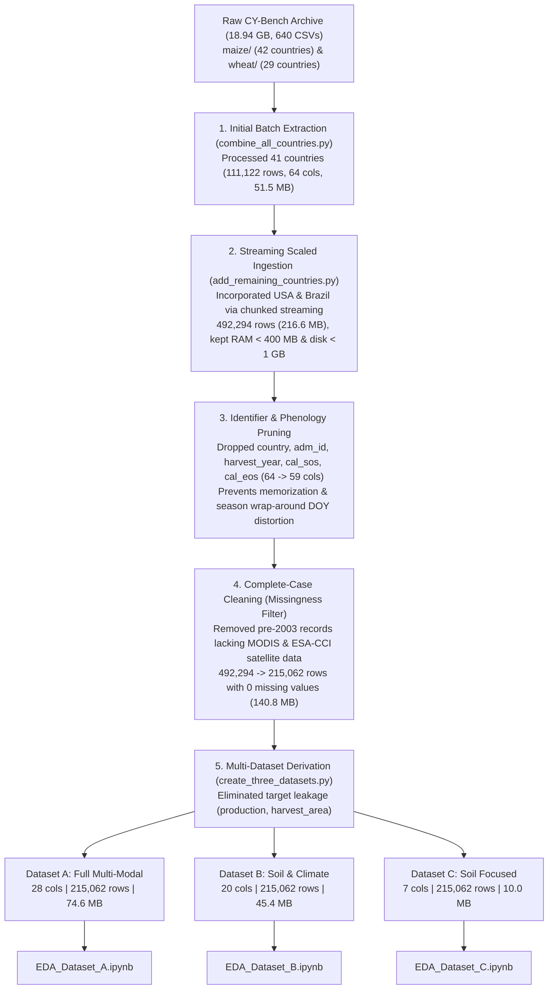

# CY-Bench Crop Yield Data Processing: Project Summary & Workflow Overview

**Directory:** `c:\Users\Hamza\Downloads\cybench-data`  
**Crops Covered:** Maize (*Zea mays*) and Wheat (*Triticum aestivum*)  
**Spatial Coverage:** 43 Countries (Global)  
**Temporal Coverage:** 2003–2024 (Operational Multi-Sensor Satellite Era)  
**Clean Complete Records:** 215,062 observations with **0 missing values**

---

## 1. What This Directory Is

This workspace houses the end-to-end data engineering, statistical aggregation, data cleaning, and exploratory data analysis (EDA) pipeline for the **CY-Bench (Crop Yield Benchmark)** global agricultural dataset.

The objective of this workspace was to transform **640 raw, unaligned, multi-frequency CSV files (~18.94 GB)** into clean, leakage-free, machine-learning-ready tabular datasets for predicting crop yields across the globe without running into hardware memory crashes or tabular data leakage.

---

## 2. Chronological Timeline of What Happened

---

## 3. Detailed Phase-by-Phase Breakdown

### Phase 1: Raw Data Organization & Phenology Alignment
- **Raw Storage:** `maize/` (42 ISO2 country directories) and `wheat/` (29 ISO2 country directories).
- **9 Raw Functional Layers:**
  1. `yield`: Annual reported yield (t/ha), harvested area (ha), production (t) per administrative unit (`adm_id`).
  2. `crop_calendar`: Start of Season (`sos`) and End of Season (`eos`) day-of-year (DOY).
  3. `location`: Administrative polygon centroids (`latitude`, `longitude`) and `region_area`.
  4. `soil`: Physical soil attributes (`awc`, `bulk_density`, `drainage_class`).
  5. `crop_mask`: Agricultural footprint (`crop_area`, `crop_area_pct`).
  6. `meteo`: Daily surface weather (`tmin`, `tmax`, `tavg`, `prec`, `rad`, `et0`, `vpd`, `cwb`).
  7. `ndvi`: 8-day satellite vegetation index.
  8. `fpar`: 10-day fraction of photosynthetically active radiation.
  9. `soil_moisture`: 10-day surface (`ssm`) and root-zone (`rsm`) soil moisture.
- **Season-Aware Temporal Alignment:** Instead of calendar years, observations were aligned to crop biological cycles:
  - **Normal seasons ($\text{sos} \le \text{eos}$):** Records within $[\text{sos}, \text{eos}]$ assigned to `harvest_year = calendar_year`.
  - **Cross-year winter cycles ($\text{sos} > \text{eos}$):** Records with $\text{DOY} \ge \text{sos}$ assigned to `harvest_year = calendar_year + 1`; records with $\text{DOY} \le \text{eos}$ assigned to `harvest_year = calendar_year`. Outside periods were discarded.

### Phase 2: Memory-Bounded Streaming Aggregation (`add_remaining_countries.py`)
- **Challenge:** USA and Brazil time-series files alone exceeded 15 GB raw (e.g., `meteo_maize_BR.csv` is 3.2 GB with 37.8M rows). Loading them at once into pandas caused Out-Of-Memory (OOM) crashes on the machine (~2.2 GB free RAM).
- **Solution:** A custom chunked accumulator ($1,000,000$ rows per batch) tracked 5 running summary statistics per `(adm_id, harvest_year)`:
  - Count ($N$), Sum ($S_1$), Sum of Squares ($S_2$), Minimum ($M_{\min}$), and Maximum ($M_{\max}$).
  - Final sample standard deviations and variances were derived mathematically using Bessel's correction:
    $$\mu = \frac{S_1}{N}, \quad s = \sqrt{\max\left(0, \frac{S_2 - \frac{S_1^2}{N}}{N - 1}\right)}$$
- **Result:** Memory was strictly kept under **400 MB RAM**, and the output CSV stayed well within the enforced **1 GB file size ceiling** (peaked at 216.6 MB for 492,294 rows across 43 countries).

### Phase 3: Spatial De-biasing, Phenology Pruning & Complete-Case Cleaning
1. **Identifier & Temporal Shortcut Removal:**
   - Dropped `country`, `adm_id`, and `harvest_year`.
   - **Rationale:** Prevents tree-based and deep models from overfitting on arbitrary administrative codes or memorizing historical global weather trends by year.
2. **Phenology Calendar Pruning (`cal_sos`, `cal_eos`):**
   - Dropped `cal_sos` and `cal_eos` across all datasets (reducing master features from 64 to 59).
   - **Rationale:** **Season wrap-around. `cal_sos > cal_eos` in 42% of maize rows, 21% of wheat and 5% of winter wheat.** In cross-calendar-year cycles, raw DOY integers wrap past December 31 (e.g. SOS=310 > EOS=120), introducing artificial numerical discontinuities. Because crop calendar boundaries were already used dynamically to align weather, vegetation, and soil moisture features to the actual biological growing period, static DOY integer bounds are redundant and distort tabular models.
3. **Missing Value Purge:**
   - Pre-2003 records predated satellite sensors (MODIS NDVI/FPAR operational ~2000, ESA-CCI soil moisture ~2003), leaving ~54% of records with null values in remote sensing columns.
   - Dropped all incomplete rows (`dropna()`).
   - Cleaned dataset retained **215,062 high-quality, complete observations** with **zero missing values** across all 59 columns (140.78 MB).

### Phase 4: Constructing 3 Leakage-Free Datasets (`create_three_datasets.py`)
Crop yield is defined as $\text{yield} = \frac{\text{production}}{\text{harvest\_area}}$. Retaining `production` or `harvest_area` causes trivial target leakage. These variables were eliminated, producing three specialized modeling datasets:

| Dataset | File | Columns | Rows | Size | Target Use Case |
|---|---|---|---|---|---|
| **Dataset A** | `dataset_A_full_leakage_free.csv` | **28** | 215,062 | 74.60 MB | **Full Multi-Modal Model:** Fuses soil physical properties, daily meteorology moments, MODIS NDVI/FPAR, ESA-CCI soil moisture, and geographic coordinates (leakage-free and season wrap-around free). |
| **Dataset B** | `dataset_B_soil_climate.csv` | **20** | 215,062 | 45.44 MB | **Satellite-Free Climate Model:** Combines soil properties, 12 climate statistics, and coordinates. Operates independently of satellite sensors for pre-season forecasting and historical simulation. |
| **Dataset C** | `dataset_C_soil_focused.csv` | **7** | 215,062 | 9.96 MB | **Minimal Soil Baseline:** Isolates intrinsic soil-driven yield predictability using only soil parameters (`awc`, `bulk_density`, `drainage_class`), geographic coordinates (`latitude`, `longitude`), `crop`, and `yield`. |

### Phase 5: Exploratory Data Analysis (`EDA_Dataset_*.ipynb`)
Three standalone Jupyter notebooks were executed to profile each dataset:
- Verified 0 duplicate rows and 0 missing values across all three datasets.
- Generated descriptive statistical tables (`describe(include='all')`).
- Computed IQR-based outlier bounds for every numerical variable.
- Plotted distribution histograms and boxplots for all features.
- Generated full correlation heatmaps and bivariate relationships against the target `yield`.

---

## 4. File Inventory in This Directory

| Filename | Type | Size | Role / Description |
|---|---|---|---|
| [`combined_yield_features.csv`](file:///c:/Users/Hamza/Downloads/cybench-data/combined_yield_features.csv) | CSV Data | 140.78 MB | **Master Dataset:** 215,062 rows $\times$ 59 columns (0 nulls). Complete merged features for 43 countries (2003–2024). |
| [`dataset_A_full_leakage_free.csv`](file:///c:/Users/Hamza/Downloads/cybench-data/dataset_A_full_leakage_free.csv) | CSV Data | 74.60 MB | **Dataset A:** 28 columns. Full multi-modal feature set (soil, weather, satellites, soil moisture, coordinates, yield). |
| [`dataset_B_soil_climate.csv`](file:///c:/Users/Hamza/Downloads/cybench-data/dataset_B_soil_climate.csv) | CSV Data | 45.44 MB | **Dataset B:** 20 columns. Satellite-free climate + soil feature set. |
| [`dataset_C_soil_focused.csv`](file:///c:/Users/Hamza/Downloads/cybench-data/dataset_C_soil_focused.csv) | CSV Data | 9.96 MB | **Dataset C:** 7 columns. Minimalist soil physical properties + coordinates baseline. |
| [`combine_all_countries.py`](file:///c:/Users/Hamza/Downloads/cybench-data/combine_all_countries.py) | Python Script | 11.78 KB | Initial aggregation pipeline for the first 41 countries. |
| [`add_remaining_countries.py`](file:///c:/Users/Hamza/Downloads/cybench-data/add_remaining_countries.py) | Python Script | 16.77 KB | Streaming chunked aggregation engine that ingested USA and Brazil while safeguarding RAM (<400 MB) and disk (<1 GB). |
| [`create_three_datasets.py`](file:///c:/Users/Hamza/Downloads/cybench-data/create_three_datasets.py) | Python Script | 4.03 KB | Script that generated Datasets A, B, and C by removing leakage variables and filtering target feature subsets. |
| [`EDA_Dataset_A.ipynb`](file:///c:/Users/Hamza/Downloads/cybench-data/EDA_Dataset_A.ipynb) | Jupyter Notebook | 2.28 MB | Executed EDA notebook for Dataset A (distributions, correlations, outliers, target plots). |
| [`EDA_Dataset_B.ipynb`](file:///c:/Users/Hamza/Downloads/cybench-data/EDA_Dataset_B.ipynb) | Jupyter Notebook | 1.36 MB | Executed EDA notebook for Dataset B. |
| [`EDA_Dataset_C.ipynb`](file:///c:/Users/Hamza/Downloads/cybench-data/EDA_Dataset_C.ipynb) | Jupyter Notebook | 396.38 KB | Executed EDA notebook for Dataset C. |
| [`implementation_plan.md`](file:///c:/Users/Hamza/Downloads/cybench-data/implementation_plan.md) | Markdown | 4.02 KB | Design plan specifying the streaming aggregation logic, RAM budgets, and 1 GB guardrail. |
| [`dataset_creation_report.md`](file:///c:/Users/Hamza/Downloads/cybench-data/dataset_creation_report.md) | Markdown | 20.15 KB | Comprehensive 290-line technical engineering report detailing the mathematical formulation, schema, and audit. |
| `maize/` | Directory | ~9.5 GB | Raw data subdirectories for 42 countries across all 9 data layers for maize. |
| `wheat/` | Directory | ~9.4 GB | Raw data subdirectories for 29 countries across all 9 data layers for wheat. |

---

## 5. Output Synchronization

In addition to this workspace, final datasets have been synchronized to:
- `C:\Users\Hamza\Desktop\YP\all_countries_yield_data\`
- `C:\Users\Hamza\Desktop\YP\!!!!!Preprocessing\`
- `C:\Users\Hamza\Desktop\YP\combined_yield_features_all_countries.csv`
