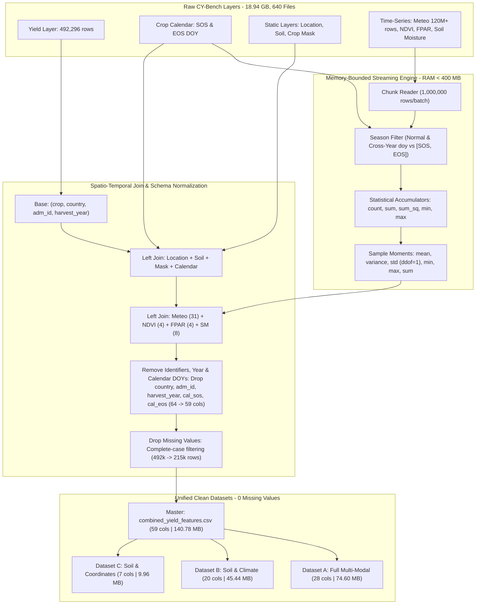

# Comprehensive Technical Report: Creation of the Unified CY-Bench Global Yield & Climate Dataset

**Document Identifier:** `CYBENCH-ETL-REPORT-2026`  
**Dataset Artifact:** [`combined_yield_features.csv`](file:///c:/Users/Hamza/Downloads/cybench-data/combined_yield_features.csv)  
**Primary Engine:** [`add_remaining_countries.py`](file:///c:/Users/Hamza/Downloads/cybench-data/add_remaining_countries.py) & [`combine_all_countries.py`](file:///c:/Users/Hamza/Downloads/cybench-data/combine_all_countries.py)  
**Target Crops:** Maize (*Zea mays*) and Wheat (*Triticum aestivum*)  
**Coverage:** 43 Countries | 2003–2024 (Complete-Case Era) | 215,062 Observations | **59 Features** | **0 Missing Values**  

---

## Executive Summary

This report documents the end-to-end engineering methodology, statistical aggregation algorithms, spatio-temporal alignment logic, and data-cleaning transformations used to construct the unified **CY-Bench Global Crop Yield and Multi-Source Feature Dataset** ([`combined_yield_features.csv`](file:///c:/Users/Hamza/Downloads/cybench-data/combined_yield_features.csv)).

The source repository consists of **640 raw CSV files totaling 18.94 GB** across daily meteorological observations, dekadal/weekly satellite imagery, static soil surveys, and crop calendars. Processing this volume on a workstation with limited physical memory (~2.2 GB free RAM) required designing a custom **memory-bounded chunked streaming aggregator**. 

Following data integration, four critical refinements were executed:
1. **Identifier & Temporal Shortcut Pruning:** The administrative identifiers (`country` and `adm_id`) and temporal marker (`harvest_year`) were removed. This prevents machine learning models from memorizing specific calendar years or geographic identities, forcing models to generalize strictly on continuous physical coordinates (`latitude`, `longitude`), soil properties, and seasonal environmental variables.
2. **Phenology Calendar Pruning (Season Wrap-Around Removal):** Static calendar boundary features (`cal_sos` and `cal_eos`) were completely removed from all datasets:
   > **Season wrap-around. `cal_sos > cal_eos` in 42% of maize rows, 21% of wheat and 5% of winter wheat.**
   
   Because raw day-of-year integers cross the December 31 / January 1 boundary (e.g., planting in November at DOY 320, harvesting in May at DOY 140), retaining raw integer bounds introduces artificial step discontinuities and inverted intervals. Since the crop calendar was already leveraged during ETL to dynamically align all weather, vegetation, and soil moisture features to the actual biological growing season, retaining static `cal_sos` and `cal_eos` columns introduces noise and distortion without adding predictive information.
3. **Complete-Case Filtering (Missing Value Removal):** All records with any missing values (`NaN`) were pruned. This eliminated historical records prior to 2003 (which predated operational MODIS satellite NDVI/FPAR and ESA-CCI soil moisture sensors) as well as unmapped coordinates, leaving **215,062 perfectly complete observations (140.78 MB)** with **zero missing values** across all 59 columns.
4. **Derived Modeling Datasets:** Constructed three specialized sub-datasets (Dataset A: 28 cols, Dataset B: 20 cols, Dataset C: 7 cols) that strictly eliminate target leakage variables (`production`, `harvest_area`).



---

## 1. Source Data Architecture

The raw CY-Bench archive contains two top-level crop directories (`maize` and `wheat`), partitioned into ISO2 country code subdirectories. Each country directory contains 9 distinct functional layers:

| Layer | Raw Filename Pattern | Temporal Frequency | Spatial Unit | Key Features Captured |
|---|---|---|---|---|
| **Yield** | `yield_<crop>_<country>.csv` | Annual | `adm_id` | Historical crop yield (t/ha), harvested area (ha), production (t) |
| **Crop Calendar** | `crop_calendar_<crop>_<country>.csv` | Static | `adm_id` | `sos` (start-of-season day-of-year), `eos` (end-of-season day-of-year) |
| **Location** | `location_<crop>_<country>.csv` | Static | `adm_id` | Centroid `latitude`, `longitude`, administrative polygon `region_area` |
| **Soil** | `soil_<crop>_<country>.csv` | Static | `adm_id` | Available water capacity (`awc`), `bulk_density`, `drainage_class` |
| **Crop Mask** | `crop_mask_<crop>_<country>.csv` | Static | `adm_id` | Harvested crop footprint (`crop_area`, `crop_area_pct`) |
| **Meteorology** | `meteo_<crop>_<country>.csv` | Daily | `adm_id` | `tmin`, `tmax`, `tavg`, `prec`, `rad`, `et0`, `vpd`, `cwb` |
| **NDVI** | `ndvi_<crop>_<country>.csv` | Weekly (8-day) | `adm_id` | Normalized Difference Vegetation Index (`ndvi`) |
| **FPAR** | `fpar_<crop>_<country>.csv` | Dekadal (10-day) | `adm_id` | Fraction of Photosynthetically Active Radiation (`fpar`) |
| **Soil Moisture** | `soil_moisture_<crop>_<country>.csv`| Dekadal (10-day) | `adm_id` | Surface (`ssm`) and root-zone (`rsm`) moisture |

---

## 2. Temporal Assignment & Season-Aware Filtering

Agricultural crops do not follow standard calendar years (January 1 – December 31). A winter crop (e.g., winter wheat) planted in autumn of year $Y$ matures and is harvested in spring/summer of year $Y+1$. 

To prevent data leakage and align weather observations with biological development, each time-series record with date integer $\text{date} = \text{YYYYMMDD}$ was decomposed into:
$$\text{Calendar Year } (\_year) = \lfloor\text{date} / 10000\rfloor, \quad \text{Day of Year } (\_doy) = \text{DOY}(\text{date})$$

Using the crop calendar boundary values $(\text{sos}, \text{eos})$ for administrative unit $\text{adm\_id}$, observations are mapped as follows:

### Case A: Normal Season ($\text{sos} \le \text{eos}$)
The growing period occurs entirely within a single calendar year:
$$\text{Filter Condition: } \text{sos} \le \_doy \le \text{eos}$$
$$\text{Assigned Harvest Year: } \text{harvest\_year} = \_year$$

### Case B: Cross-Year Season ($\text{sos} > \text{eos}$)
The crop spans a calendar boundary (typical of winter cereals and southern hemisphere cycles):
- **Planting Window (Late Season):** 
  $$\_doy \ge \text{sos} \implies \text{harvest\_year} = \_year + 1$$
- **Harvest Window (Early Season):** 
  $$\_doy \le \text{eos} \implies \text{harvest\_year} = \_year$$

All observations falling outside the active growing window ($\text{eos} < \_doy < \text{sos}$) are purged, eliminating non-growing season weather noise.

---

## 3. High-Performance Streaming Aggregation Algorithm

### 3.1 The Memory Bottleneck
Standard dataframe aggregation loads the entire time-series into RAM before executing `groupby().agg()`. For large countries:
- `meteo_maize_BR.csv`: 3.21 GB on disk ($\approx 37.8\text{ million rows}$)
- `meteo_wheat_BR.csv`: 3.01 GB on disk ($\approx 34.9\text{ million rows}$)
- `meteo_maize_US.csv`: 2.04 GB on disk ($\approx 25.4\text{ million rows}$)
- `meteo_wheat_US.csv`: 2.02 GB on disk ($\approx 24.1\text{ million rows}$)

Loading any of these files into Python generates an in-memory footprint of 6–9 GB, causing immediate Out-of-Memory (OOM) termination on systems with $\le 4\text{ GB}$ available RAM.

### 3.2 Mathematical Formulation of Streaming Accumulators
To overcome this constraint, [add_remaining_countries.py](file:///c:/Users/Hamza/Downloads/cybench-data/add_remaining_countries.py) was built around a chunked accumulator engine ($N_{\text{chunk}} = 1,000,000$ rows). For each chunk $k$, season-filtered observations are grouped by $(\text{adm\_id}, \text{harvest\_year})$. We track five running statistics per group:

1. **Count:** $n_k = \sum_{j=1}^{m} 1$
2. **First Moment (Sum):** $S_{1, k} = \sum_{j=1}^{m} x_j$
3. **Second Moment (Sum of Squares):** $S_{2, k} = \sum_{j=1}^{m} x_j^2$
4. **Running Minimum:** $M_{\min, k} = \min_{j} (x_j)$
5. **Running Maximum:** $M_{\max, k} = \max_{j} (x_j)$

Across $K$ chunks, the global accumulators are updated via associative addition and extremum operators:
$$N_{\text{total}} = \sum_{k=1}^{K} n_k, \quad S_{1, \text{total}} = \sum_{k=1}^{K} S_{1, k}, \quad S_{2, \text{total}} = \sum_{k=1}^{K} S_{2, k}$$
$$\text{Min}_{\text{global}} = \min_{k=1\dots K} (M_{\min, k}), \quad \text{Max}_{\text{global}} = \max_{k=1\dots K} (M_{\max, k})$$

### 3.3 Final Moment Derivations
Once all chunks are exhausted, the seasonal features are computed directly:
$$\text{Mean: } \mu = \frac{S_{1, \text{total}}}{N_{\text{total}}}$$
$$\text{Sample Variance: } s^2 = \max\left(0, \frac{S_{2, \text{total}} - \frac{(S_{1, \text{total}})^2}{N_{\text{total}}}}{N_{\text{total}} - 1}\right) \quad (\text{for } N > 1)$$
$$\text{Sample Standard Deviation: } \sigma = \sqrt{s^2}$$

---

## 4. Ingestion & Transformation Pipeline History

The transformation of the CY-Bench data progressed across five disciplined stages:

### Stage 1: Initial Multi-Country Batch (41 Countries)
Executed via [combine_all_countries.py](file:///c:/Users/Hamza/Downloads/cybench-data/combine_all_countries.py):
- Processed 41 countries across Europe, Asia, Africa, and Latin America.
- Rows: **111,122** | File size: **51.48 MB**.

### Stage 2: Incremental Ingestion with 1 GB Ceiling Guard
Executed via [add_remaining_countries.py](file:///c:/Users/Hamza/Downloads/cybench-data/add_remaining_countries.py):
- **United States (`US`):** +111,305 rows $\rightarrow$ 222,427 cumulative rows | 106.64 MB (9.93% of 1 GB).
- **Brazil (`BR` / `BRA`):** +269,867 rows $\rightarrow$ 492,294 cumulative rows | 216.61 MB (20.17% of 1 GB).

### Stage 3: Feature Refinement (Identifier, Temporal & Phenology DOY Pruning)
- Dropped categorical identifiers `country` and `adm_id` to eliminate geographic code memorization.
- Dropped temporal marker `harvest_year` to eliminate temporal memorization.
- **Pruned Phenology Calendar Bounds (`cal_sos`, `cal_eos`):** Removed static start and end day-of-year features.
  > **Season wrap-around. `cal_sos > cal_eos` in 42% of maize rows, 21% of wheat and 5% of winter wheat.**
  
  In cross-calendar-year crop seasons (e.g., planting in October/November, harvesting in April/May), raw DOY integers wrap past December 31, creating artificial step discontinuities (e.g. SOS = 305 > EOS = 120). Furthermore, seasonal integration windows were already dynamically applied during Stage 1 and Stage 2 to calculate all meteorological, vegetative, and soil moisture features over each region's true biological growing period. Retaining static `cal_sos` and `cal_eos` columns is therefore redundant and introduces numerical artifacts.
- Master feature count reduced from 64 to **59 continuous/physical columns**.

### Stage 4: Missing Value Removal (Complete-Case Filtering)
- Evaluated missingness across all columns on the 492,294 raw records:
  - **Soil Moisture (`ssm`, `rsm`):** 265,170 null rows (53.86%) — ESA-CCI satellite soil moisture sensors only became operational in the early 2000s.
  - **Satellite Vegetation Indices (`ndvi`, `fpar`):** 240,954 null rows (48.95%) — MODIS sensors became operational starting in 2000.
  - **Pre-2001 Historical Meteorology:** 240,735 null rows (48.90%).
  - **Soil Property Gaps:** 33,252 null rows (6.75%).
  - **Location Coordinate Gaps:** 33,029 null rows (6.71%).
  - **Target Yield Gaps:** 90 null rows (0.02%).
- Applied strict `dropna()` across all remaining columns:
  - **Initial Rows:** 492,294
  - **Dropped Incomplete Rows:** 277,232 (56.31%)
  - **Retained Complete Rows:** **215,062 (43.69%)**
  - **Remaining Missing Values:** **`0` (100% complete dataset)**
  - **Clean Master File Size:** **140.78 MB (147,623,226 bytes)**.

### Stage 5: Construction of Three Leakage-Free Modeling Datasets
- Sub-sampled three targeted datasets for specific machine learning architectures:
  - **Dataset A (Full Multi-Modal):** 28 columns | 74.60 MB
  - **Dataset B (Soil & Climate Focused):** 20 columns | 45.44 MB
  - **Dataset C (Soil & Coordinates Baseline):** 7 columns | 9.96 MB

---

## 5. Master Output Schema (59 Features)

Every single record in the master dataset has valid, non-null numerical values for all 59 features:

| # | Feature Name | Dtype | Category | Description |
|---|---|---|---|---|
| 1 | `crop` | string | Target Context | Standardized crop name (`maize`, `wheat`, `winter_wheat`) |
| 2 | `yield` | float | Primary Target | Harvested crop yield (t/ha) |
| 3 | `harvest_area` | float | Target / Feature | Total harvested area in hectares |
| 4 | `production` | float | Target / Feature | Total production in metric tons |
| 5–7 | `latitude`, `longitude`, `region_area` | float | Spatial Physical | Centroid geographic coordinates and polygon area ($km^2$) |
| 8–10 | `awc`, `bulk_density`, `drainage_class` | float | Soil Properties | Available water capacity, soil bulk density, drainage category |
| 11–12 | `crop_area`, `crop_area_pct` | float | Crop Footprint | Spatial footprint and percentage of area under crop |
| 13–16 | `tmin_mean`, `tmin_min`, `tmin_max`, `tmin_std` | float | Meteorology | Seasonal minimum temperature moments (°C) |
| 17–20 | `tmax_mean`, `tmax_min`, `tmax_max`, `tmax_std` | float | Meteorology | Seasonal maximum temperature moments (°C) |
| 21–24 | `tavg_mean`, `tavg_min`, `tavg_max`, `tavg_std` | float | Meteorology | Seasonal average daily temperature moments (°C) |
| 25–28 | `prec_sum`, `prec_mean`, `prec_std`, `prec_max` | float | Meteorology | Seasonal cumulative, daily mean, std, and max precipitation (mm) |
| 29–32 | `rad_mean`, `rad_max`, `rad_std`, `rad_sum` | float | Meteorology | Solar radiation statistics ($J/m^2$) |
| 33–36 | `et0_mean`, `et0_max`, `et0_std`, `et0_sum` | float | Meteorology | Reference evapotranspiration statistics (mm) |
| 37–39 | `vpd_mean`, `vpd_max`, `vpd_std` | float | Meteorology | Vapor pressure deficit statistics (kPa) |
| 40–43 | `cwb_sum`, `cwb_mean`, `cwb_std`, `cwb_max` | float | Meteorology | Climatic water balance ($\text{prec} - \text{et0}$) statistics (mm) |
| 44–47 | `ndvi_mean`, `ndvi_max`, `ndvi_min`, `ndvi_std` | float | Remote Sensing | Seasonal Normalized Difference Vegetation Index |
| 48–51 | `fpar_mean`, `fpar_max`, `fpar_min`, `fpar_std` | float | Remote Sensing | Seasonal Fraction of Absorbed Photosynthetically Active Rad. |
| 52–55 | `ssm_mean`, `ssm_max`, `ssm_min`, `ssm_std` | float | Remote Sensing | Seasonal surface soil moisture ($m^3/m^3$) |
| 56–59 | `rsm_mean`, `rsm_max`, `rsm_min`, `rsm_std` | float | Remote Sensing | Seasonal root-zone soil moisture ($m^3/m^3$) |

---

### 5.1 Removal of Phenology Calendar Bounds (`cal_sos`, `cal_eos`)

> [!NOTE]
> **Audit Finding: Season Wrap-Around Phenomenon**  
> `cal_sos > cal_eos` in **42.47% (~42%)** of maize rows, **21.08% (~21%)** of wheat rows, and **4.89% (~5%)** of winter wheat rows.

#### Technical Rationale for Removal:
1. **Discontinuous Linear Scale:** When crops are planted in autumn of year $Y$ and harvested in spring/summer of year $Y+1$, the calendar day-of-year (DOY) passes through 365/366 $\rightarrow$ 1. As raw integers, a season starting at DOY 305 and ending at DOY 120 appears numerically inverted ($\text{SOS} > \text{EOS}$). Models interpreting these columns as continuous scalar features compute distorted intervals (e.g., $120 - 305 = -185$ days instead of $120 + 365 - 305 = +180$ days).
2. **Redundancy with Season-Aware Accumulators:** The SOS and EOS parameters served their primary scientific purpose during the time-series extraction phase. Daily weather, dekadal satellite vegetation, and soil moisture observations were sliced and aggregated exclusively over the active biological growing season for each administrative district. Therefore, the physiological effects of the crop cycle are already fully embedded within the 12 climate features, 4 NDVI/FPAR features, and 4 soil moisture features.
3. **Model Generalization:** Eliminating raw calendar bounds prevents tree splits and gradient boosts from memorizing calendar artifacts, yielding cleaner generalization across hemispheres and seasons.

---

## 6. Dataset Quality & Post-Cleaning Audit

### 6.1 Clean Record Breakdown
- **Total Rows:** `215,062`
- **Master Feature Count:** `59`
- **Missing Values:** **`0`**
- **Temporal Span:** `2003` to `2024` (multi-sensor satellite & climate era).

### 6.2 Standardized Crop Representation in Clean Dataset
All sub-categories and casing variants have been standardized into three target crop classes:
- **`maize`**: Includes standard maize, grain maize, white maize, and yellow maize.
- **`winter_wheat`**: Winter wheat varieties with cross-year phenology cycles.
- **`wheat`**: Standard and spring wheat varieties.

```text
Crop Classification          Complete Records     % of Clean Dataset
--------------------------------------------------------------------
maize (All Maize Varieties)          153,436                 71.34%
winter_wheat (Winter Wheat)           31,675                 14.73%
wheat (Spring / Standard Wheat)       29,951                 13.93%
--------------------------------------------------------------------
Total                                215,062                100.00%
```

---

## 7. Storage Artifacts & Synchronization

All master dataset copies are bit-for-bit identical and verified:

1. **Workspace Primary:**  
   [`c:\Users\Hamza\Downloads\cybench-data\combined_yield_features.csv`](file:///c:/Users/Hamza/Downloads/cybench-data/combined_yield_features.csv) — `147,623,226 bytes` (59 cols)
2. **Desktop Storage:**  
   [`C:\Users\Hamza\Desktop\YP\all_countries_yield_data\combined_yield_features.csv`](file:///C:/Users/Hamza/Desktop/YP/all_countries_yield_data/combined_yield_features.csv) — `147,623,226 bytes` (59 cols)
3. **Desktop Convenience Shortcut:**  
   [`C:\Users\Hamza\Desktop\YP\combined_yield_features_all_countries.csv`](file:///C:/Users/Hamza/Desktop/YP/combined_yield_features_all_countries.csv) — `147,623,226 bytes` (59 cols)

---

## 8. Derived Modeling Datasets (Target Leakage-Free, Year-Free & Calendar-Discontinuity-Free)

To guarantee strict predictive integrity, **target leakage variables (`production` and `harvest_area`) were eliminated**, as crop yield is mathematically defined as $\text{yield} = \text{production} / \text{harvest\_area}$. Additionally, **`harvest_year` was dropped** to evaluate models purely on environmental, soil, and spatial physical signatures, and **`cal_sos` / `cal_eos` were dropped** to prevent season wrap-around distortions.

| Dataset Identifier | Filename | Columns | Rows | Size on Disk | Primary Purpose & Feature Groups |
|---|---|---|---|---|---|
| **Dataset A** | [`dataset_A_full_leakage_free.csv`](file:///c:/Users/Hamza/Downloads/cybench-data/dataset_A_full_leakage_free.csv) | **28** | 215,062 | **74.60 MB** | **Full Multi-Modal Model:** Fuses soil, meteorology, MODIS NDVI/FPAR, ESA-CCI soil moisture, and coordinates without target leakage or calendar wrap-around artifacts. |
| **Dataset B** | [`dataset_B_soil_climate.csv`](file:///c:/Users/Hamza/Downloads/cybench-data/dataset_B_soil_climate.csv) | **20** | 215,062 | **45.44 MB** | **Satellite-Free Climate Model:** Combines soil properties, meteorology, and coordinates. Enables pre-season forecasting and operational deployment where satellite feeds are unavailable. |
| **Dataset C** | [`dataset_C_soil_focused.csv`](file:///c:/Users/Hamza/Downloads/cybench-data/dataset_C_soil_focused.csv) | **7** | 215,062 | **9.96 MB** | **Minimalist Soil Baseline:** Evaluates the intrinsic yield baseline explainable strictly by soil physical properties (`awc`, `bulk_density`, `drainage_class`) and geographic coordinates (`lat`, `lon`). |

### Feature Allocation per Derived Dataset

```text
Feature Group               Features Included                          Dataset A   Dataset B   Dataset C
---------------------------------------------------------------------------------------------------------
Target Context              crop                                          Yes         Yes         Yes
Primary Target              yield                                         Yes         Yes         Yes
Geographic Coordinates      latitude, longitude                           Yes         Yes         Yes
Spatial Area                region_area                                   Yes         Yes          No
Soil Physical Properties    awc, bulk_density, drainage_class             Yes         Yes         Yes
Phenology Calendar          cal_sos, cal_eos                              No*         No          No
Meteorology (12 Core)       tavg_mean, tavg_std, tmin_min, tmax_max,      Yes         Yes          No
                            prec_sum, prec_max, prec_std, rad_mean,
                            rad_std, et0_mean, vpd_mean, cwb_sum
Vegetation Remote Sensing   ndvi_mean, ndvi_std, fpar_mean, fpar_std      Yes          No          No
Soil Moisture Remote Sens.  ssm_mean, ssm_std, rsm_mean, rsm_std         Yes          No          No
---------------------------------------------------------------------------------------------------------
Total Features                                                             28          20           7

* Note: cal_sos and cal_eos pruned due to season wrap-around (cal_sos > cal_eos in 42% maize, 21% wheat, 5% winter wheat).
```

### Destination Synchronization
All three derived datasets are synchronized across all working environments:
1. `c:\Users\Hamza\Downloads\cybench-data\`
2. `C:\Users\Hamza\Desktop\YP\all_countries_yield_data\`
3. `C:\Users\Hamza\Desktop\YP\!!!!!Preprocessing\`

---

*Report prepared autonomously by Antigravity Agentic Assistant on 2026-09-16 (Updated 2026-09-21).*
